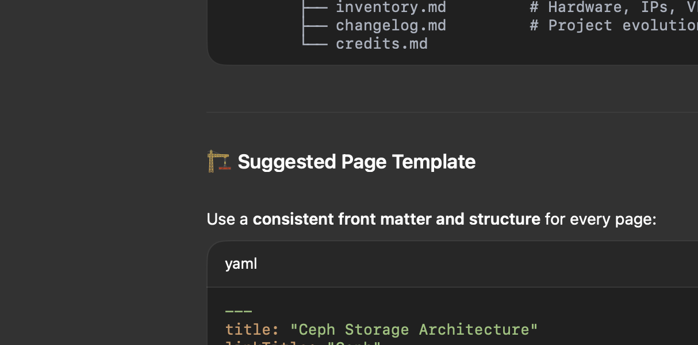

# Ceph Storage Overview

## Architecture
- 8 OSDs across 4 nodes  
- 4+2 erasure-coded pool for capacity
- NVMe pool for metadata and WAL/DB

## Key Features
- CephFS for Kubernetes PVCs
- RBD images for VM disks
- Snapshot mirroring + replication

## Performance Tuning
- OSDs pinned to dedicated NVMe WAL/DB
- PG count: 256 per pool (tuned for 4+2)
- Monitors distributed evenly across nodes

## Monitoring
- Dashboards via Prometheus + Ceph Exporter
- Alerts integrated with Alertmanager

{ width="800" }

