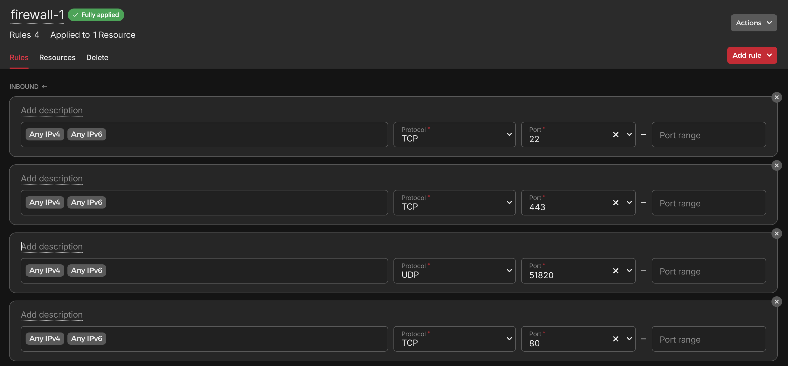

## Overview 
The purpose of this is to route traffic to your home network without opening ports on your home router. This specific example was used with Apartment internet which doesnt allow you to port forward any ports. I used it for several months until I moved into my house and got fiber internet. 

!!! note

    I no longer use this and have switched to [cloudflare tunnels](../infrastructure/cloudflare.md). I want to keep this documented in case I needed to use it in the future for anything.
## Prerequisites 
* A VPS , I used a cheap one from Hetzner 
* Open ports 80, 443, 22, 51820 to your VPS
<figure markdown="span">
    { width="1000" }
    <figcaption>Hetzner Firewall</figcaption>
</figure>
* [Basic Security Settings](../infrastructure/cloud-server.md)

## Steps

1.  Cloudflare dns points app.example.com to VPS
2.  VPS wireguard tunnel to Home Server
	1.  forwards 80 and 443 to home server
	2.  The SSH key to log into the VPS is stored on my macbook.
3.  Home Server runs traefik reverse proxy which sends traffic to Home Server
	1.  rule is in file `/home/Docker/traefik/conf/rules.yaml`
4.  Home Server runs Bitwarden


## Install 
First, you will want to add the required packages to their repository and then add their repository.

```
sudo apt install software-properties-common
#Depleted and not necessary as of on Ubuntu only Debian
sudo add-apt-repository ppa:wireguard/wireguard
```

Install wireguard.

```
#both
sudo apt update 
# to make sure we've indexed the packages on their repo
sudo apt install wireguard -y
```

### Home Server wg0.conf
Edit `/etc/wireguard/wg0.conf` and add the following. Use the command `openssl rand -base64 32` to generate random strings for the PrivateKey and PublicKey.
```bash
[Interface]
Address = 10.1.10.2  # The IP the client should take on connection
# Generate random key with `openssl rand -base64 32`
PrivateKey = xxxxxxxxxxxxxxxxxxxxxxxxxxxxxxxxxxxxxxxx  # The clients private key

[Peer]
# Generate random key with `openssl rand -base64 32`
PublicKey = xxxxxxxxxxxxxxxxxxxxxxxxxxxxxxxxxxxxxxx  # The servers public key
Endpoint = VPS_Public_IP:51820  # The IP (or hostname) of the server, along with the port WireGuard is listening on
AllowedIPs = 10.1.10.2/24  # The IPs and masks the client should route through the tunnel

PersistentKeepalive = 25  # Ensure connections remain active, especially useful over NAT

```

### VPS wg0.conf
```bash
[Interface]
Address = 10.1.10.1/32
SaveConfig = true
PostUp = iptables -A FORWARD -i %i -j ACCEPT; iptables -t nat -A POSTROUTING -o eth0 -j MASQUERADE
PostDown = iptables -D FORWARD -i %i -j ACCEPT; iptables -t nat -D POSTROUTING -o eth0 -j MASQUERADE
ListenPort = 51820
PrivateKey = xxxxxxxxxxxxxxxxxxxxxxxxxxxxxxxxxxxxxxx 

[Peer]
PublicKey = xxxxxxxxxxxxxxxxxxxxxxxxxxxxxxxxxxxxxx 
AllowedIPs = 10.1.10.2/32
Endpoint = Home_Public_IP:41658
```

### Autostart Wireguard 

1. Add the WireGuard service to systemd:
    
    ```gdscript3
    sudo systemctl enable wg-quick@wg0.service
    sudo systemctl daemon-reload
    ```
    
2. Start the new service immediately:
    
    ```fallback
    sudo systemctl start wg-quick@wg0
    ```
    
3. Reboot your computer system to verify the automatic connection on startup works as expected.
    
4. Check the service status:
    
    ```fallback
    systemctl status wg-quick@wg0
    ```

## Forwarding traffic over Wireguard to Home Server

### Sysctl Setup

Now we’ll need to make some changes to our sysctl.conf to allow our VPS to forward using IPtables. Open `/etc/sysctl.conf` in your favorite editor.

Please find the following line and remove the `#` one commenting it out. They should look like the below once done.

```
#VPS
net.ipv4.ip_forward=1

#if you wish to IP forward via IPv6 then remove the # from:
net.ipv6.conf.all.forwarding=1
```

Then we’ll apply that change with the following commands.

```
#VPS
sudo sysctl -p
sudo sysctl --system
```

### IPTables Setup
On our VPS, we’re going to set up some IPtables rules to forward to a reverse proxy running on our home server.

_Replace eth0 with the public interface of your VPS (found using `ip a`)_

```
# VPS

# By default drop traffic
sudo iptables -P FORWARD DROP

# Allow traffic on specified ports
sudo iptables -A FORWARD -i eth0 -o wg0 -p tcp --syn --dport 80 -m conntrack --ctstate NEW -j ACCEPT
sudo iptables -A FORWARD -i eth0 -o wg0 -p tcp --syn --dport 443 -m conntrack --ctstate NEW -j ACCEPT

# Allow traffic between wg0 and eth0
sudo iptables -A FORWARD -i wg0 -o eth0 -m conntrack --ctstate ESTABLISHED,RELATED -j ACCEPT
sudo iptables -A FORWARD -i wg0 -o eth0 -m conntrack --ctstate ESTABLISHED,RELATED -j ACCEPT

# Forward traffic from eth0 to wg0 on specified ports
sudo iptables -t nat -A PREROUTING -i eth0 -p tcp --dport 80 -j DNAT --to-destination 10.1.10.2
sudo iptables -t nat -A PREROUTING -i eth0 -p tcp --dport 443 -j DNAT --to-destination 10.1.10.2

# Forward traffic back to eth0 from wg0 on specified ports
sudo iptables -t nat -A POSTROUTING -o wg0 -p tcp --dport 80 -d 10.1.10.2 -j SNAT --to-source 10.1.10.1
sudo iptables -t nat -A POSTROUTING -o wg0 -p tcp --dport 443 -d 10.1.10.2 -j SNAT --to-source 10.1.10.1
```

### Persisting IPTables
To have these rules persist through reboots, we’ll need to install netfilter-persistent, use it to save the current configuration, and then enable it.

```
# VPS
sudo apt install netfilter-persistent
sudo netfilter-persistent save
sudo systemctl enable netfilter-persistent
```

Then we’ll need to use iptables persistent and configure that.

```
# VPS
sudo apt install iptables-persistent
# hit yes to save the current rules.
```
